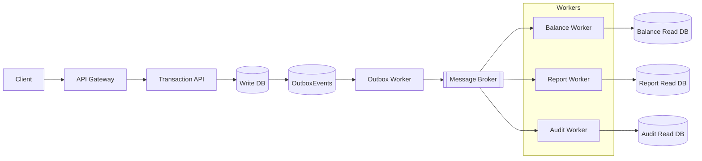
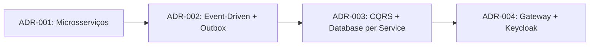
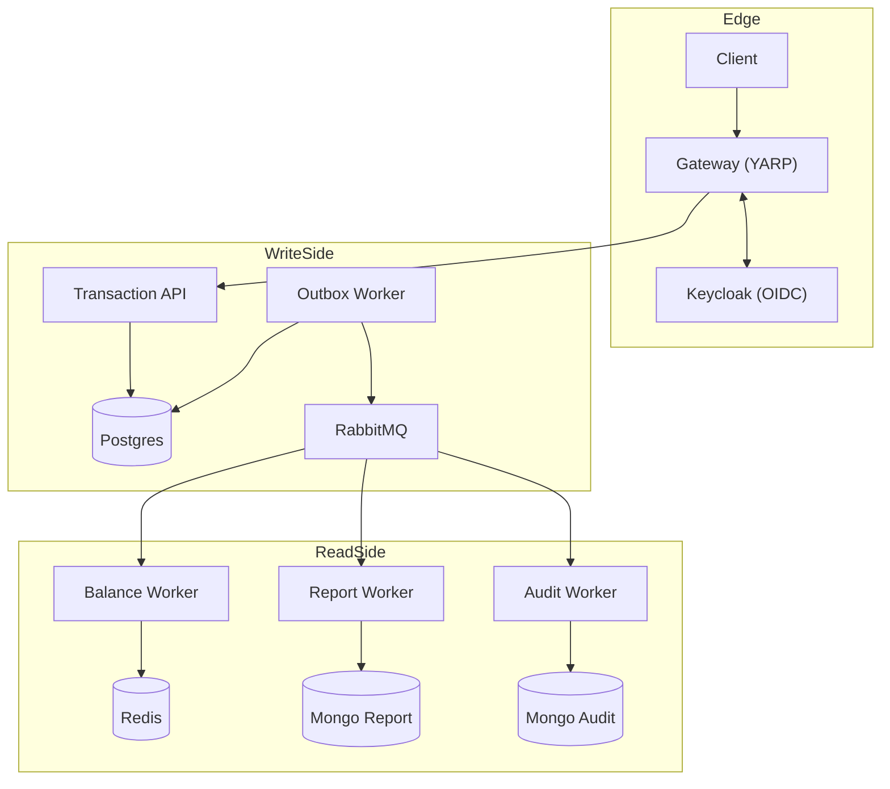
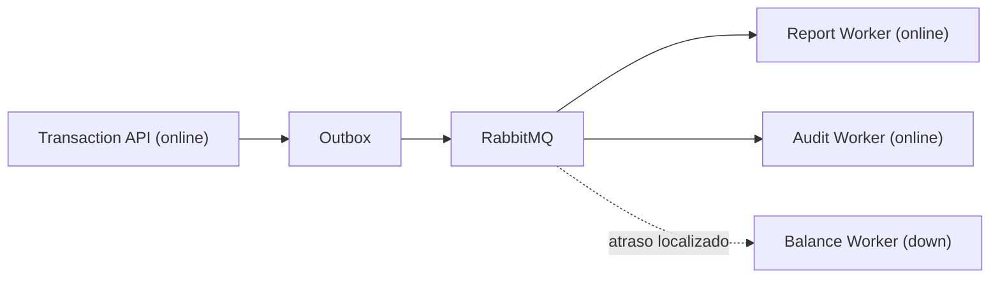
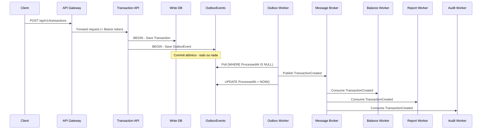

# Cashflow - Sistema de Transações Event-Driven

**Autor:** Antonio Leonardo
**Plataforma:** .NET 10
**Estilo arquitetural:** Microsserviços orientados a eventos
**Estratégia:** Multicloud portável (AWS, Azure, GCP)
**Execução local (TDD):** Visual Studio 2026 Community + Docker

---

## Índice

1. [Visão geral](#1-visão-geral)
2. [Decisões arquiteturais e trade-offs](#2-decisões-arquiteturais-e-trade-offs)
3. [Requisitos não funcionais](#3-requisitos-não-funcionais)
4. [Integração entre componentes](#4-integração-entre-componentes)
5. [Stack tecnológica](#5-stack-tecnológica)
6. [Arquitetura e diagramas](#6-arquitetura-e-diagramas)
7. [Fluxo principal](#7-fluxo-principal)
8. [Versionamento de eventos](#8-versionamento-de-eventos)
9. [Testes e qualidade](#9-testes-e-qualidade)
10. [Execução local](#10-execução-local)
11. [Estrutura da solution](#11-estrutura-da-solution)
12. [CI/CD](#12-cicd)
13. [SonarQube (Code Smells)](#13-sonarqube-code-smells)
14. [Roadmap](#14-roadmap)
15. [Evidências por requisito](#15-evidências-por-requisito)

---

## 1. Visão geral

O **Cashflow** é um sistema de transações financeiras construído sobre **Event-Driven Architecture**, **CQRS** e **Clean Architecture**. O objetivo central é garantir resiliência, escalabilidade e portabilidade real entre clouds, sem lock-in tecnológico.

Princípios fundamentais:

- Event-Driven: eventos imutáveis como contratos entre serviços
- CQRS: Write Model isolado dos Read Models por serviço
- Clean Architecture: domínio independente de infraestrutura
- Outbox Pattern: consistência atômica entre banco e mensageria
- Idempotência: consumidores seguros a reentregas
- Observabilidade: CorrelationId + logs estruturados



---

## 2. Decisões arquiteturais e trade-offs

As decisões principais estão registradas em ADRs e, para facilitar avaliação técnica, estão consolidadas abaixo no README principal.
Matriz consolidada de decisão/riscos/mitigações: `docs/decisions/decision-matrix.md`.

### 2.1 ADR-001 - Microservices vs Monolith

Referência: `docs/decisions/adr-001-microservices-vs-monolith.md`

Contexto:
- O domínio exige evolução independente entre escrita (transação) e leitura (saldo, relatório e auditoria).
- Isolamento de falhas foi tratado como requisito de arquitetura.

Decisão:
- Adotar microsserviços: `transaction-api`, `balance-query-api`, `outbox-worker`, `balance-worker`, `report-worker`, `audit-worker`.

Alternativas consideradas:
- Monolito modular com filas internas.
- Monolito modular com banco único.

Trade-offs:
- Positivos: isolamento de falhas, deploy independente, escala horizontal por serviço.
- Negativos: maior complexidade operacional e maior exigência de observabilidade.

### 2.2 ADR-002 - Integração Event-Driven vs Síncrona

Referência: `docs/decisions/adr-002-event-driven-vs-sync.md`

Contexto:
- Evitar chamadas síncronas em cascata no fluxo de consolidação.
- Garantir desacoplamento real entre serviços de leitura e escrita.

Decisão:
- Integração assíncrona por eventos com `Outbox Pattern` + broker.

Alternativas consideradas:
- HTTP síncrono entre serviços.
- Filas internas sem broker e sem envelope de contrato.

Trade-offs:
- Positivos: desacoplamento, backpressure, maior tolerância a falhas.
- Negativos: consistência eventual, necessidade de idempotência e versionamento de eventos.

### 2.3 ADR-003 - Database per Service + CQRS

Referência: `docs/decisions/adr-003-db-per-service-cqrs.md`

Contexto:
- Escrita exige consistência transacional.
- Leitura exige modelos especializados de alta performance.

Decisão:
- Separar write/read (CQRS) e manter banco por serviço.

Alternativas consideradas:
- Banco único compartilhado.
- Read models dentro do mesmo banco transacional.

Trade-offs:
- Positivos: autonomia de contexto, escalabilidade do read side e menor acoplamento.
- Negativos: consultas cross-service exigem materialização por eventos.

### 2.4 ADR-004 - Gateway com Keycloak (OIDC)

Referência: `docs/decisions/adr-004-gateway-auth-keycloak.md`

Contexto:
- Autenticação deve ser centralizada e desacoplada do domínio.
- Necessidade de política de acesso unificada na borda.

Decisão:
- Gateway (YARP) com autenticação OIDC/OAuth2 via Keycloak.

Alternativas consideradas:
- Autenticação distribuída em cada serviço.
- Gateway com provedor proprietário.

Trade-offs:
- Positivos: governança de acesso, isolamento do domínio e padrão único de autenticação.
- Negativos: dependência adicional e necessidade de testes de integração de autenticação.

### 2.5 Encadeamento das Decisões



---

## 3. Requisitos não funcionais

Escalabilidade:

- Serviços stateless com escalonamento horizontal (API e workers).
- Filas por evento e processamento assíncrono para backpressure.
- Read models otimizados (Redis, MongoDB, DynamoDB) para consultas rápidas.
- Políticas de resiliência (retry, circuit breaker, bulkhead, timeout) via `Cashflow.Shared.Resilience`.
- Meta operacional validada por carga: `50 req/s` com até `5%` de perda (`http_req_failed <= 0.05`) e latência `p95 <= 1500 ms`.

Resiliência:

- Outbox Pattern para evitar falha parcial entre banco e broker.
- Consumidores idempotentes e controle de reentrega.
- DLQ e retry com atraso configurável por consumidor (RabbitMQ).
- Recuperação automática de conexão no cliente RabbitMQ (`AutomaticRecoveryEnabled` + `TopologyRecoveryEnabled`).
- Isolamento por serviço e por fila para evitar falhas em cascata.

Disponibilidade:

- Independência entre serviços: falha de um worker não bloqueia os demais.
- Gateway e API podem evoluir sem downtime dos workers.
- Endpoints de saúde (`/health/live` e `/health/ready`) no Gateway, Transaction API e Balance Query API.
- Arquitetura preparada para multi-az e multi-cloud com configuração externa.

Segurança e observabilidade:

- Autenticação centralizada via Keycloak (OIDC/OAuth2).
- Autorização por política de escopo/role no write path (`transactions.write` / `transactions.writer`).
- Rate limiting no Gateway por política de rota sensível (write/read/balance) e limite global.
- Contrato HTTP versionado por URL (`/api/v1/...`) com compatibilidade de rota legado.
- CorrelationId propagado em toda a cadeia de eventos.
- Logs estruturados e rastreio distribuído com OpenTelemetry.

- Métricas operacionais (SLI/SLO) e evidências: `docs/sli-slo.md`.
---

## 4. Integração entre componentes

- Comunicação assíncrona via eventos (mensageria com envelopes e metadados).
- Outbox Worker publica eventos de domínio de forma confiável.
- Saga Pattern coordena etapas com compensações em caso de falha.
- Versionamento de eventos protege contratos sem breaking changes.
- Validação de integração robusta por teste: fan-out entre consumidores independentes e envio para DLQ após retries.

A integração real ocorre exclusivamente por mensageria. Chamadas síncronas ficam restritas ao Gateway -> Transaction API, preservando desacoplamento entre workers.

---

## 5. Stack tecnológica

```
Backend        .NET 10 | ASP.NET Core Web API | C#
Segurança      Keycloak (OIDC / OAuth2)
Mensageria     RabbitMQ (local) + abstrações multicloud
Containers     Docker | Docker Compose
Testes         xUnit | Testcontainers | Pact | k6
CI/CD          GitHub Actions
```

---

## 6. Arquitetura e diagramas

### 6.1 Diagrama de containers (runtime)



### 6.2 Diagrama de isolamento de falhas (serviço independente)



### 6.3 Referências complementares

- Arquitetura detalhada: `docs/architecture.md`
- Runbook de carga (k6): `Back.End/Tests/Performance/README.md`
- Configuração de ambiente/compose: `docs/docker-compose-config.md`
- Estratégia de versionamento de API: `docs/api-versioning.md`
- Runbook HA/failover local: `docs/ha-failover-runbook.md`
- Runbook TLS end-to-end: `docs/tls-end-to-end.md`
- Manifests Kubernetes: `k8s/README.md`

---

## 7. Fluxo principal



---

## 8. Versionamento de eventos

Eventos são **contratos imutáveis**. Novas versões são adicionadas em paralelo sem quebrar consumidores existentes.

```
Back.End/Service/Transaction/Domain/
  TransactionCreatedEventV1.cs
```

Regras de Evolução:

- Nunca remover campos em versões existentes
- Novos campos obrigatórios exigem nova versão
- Consumidores podem optar por escutar v1, v2 ou ambas
- O `EventType` publicado inclui a versão
- Versionamento de HTTP publicado em: `docs/api-versioning.md`

---

## 9. Testes e qualidade

Tipos e objetivos:

- Unitários: regras de domínio e validações puras
- Integração: bancos, mensageria e gateway de autenticação
- E2E: pipeline completo de eventos e read models
- Contract: compatibilidade entre Gateway e APIs de escrita/consulta

Novidade: testes de integração do Gateway com Keycloak garantem Autenticação real por OIDC.

Como rodar testes (exemplos):

```bash
# Fluxo holístico (gateway + keycloak + downstreams)
 dotnet test Back.End/Tests/IntegrationTests/Holistic/Holistic.Integration.Tests.csproj

# Integração dedicada da Balance Query API
 dotnet test Back.End/Tests/IntegrationTests/Balance/Balance.Integration.Tests.csproj

# E2E completo
 dotnet test Back.End/Tests/E2E
```

Teste de carga NFR (Passo 3):

```bash
# sobe stack principal
docker compose up -d

# executa perfil de carga (k6)
docker compose --profile perf run --rm k6
```

Evidência gerada:

- `Back.End/Tests/Performance/results/transactions-throughput-summary.json`
- `Back.End/Tests/Performance/results/daily-balance-throughput-summary.json`
- Wrapper para Test Explorer (Visual Studio): `Back.End/Tests/Performance/k6/K6.Performance.Tests.csproj`
- cenário NFR aprofundado: indisponibilidade do `balance-worker` sob carga com disponibilidade do write path.
- cenário NFR diário: disponibilidade do consolidado diário (`GET /api/v1/balance/daily/{accountId}?date=yyyy-MM-dd`) sob carga.
- Contract tests de consulta: `Back.End/Tests/ContractTests/Balance/GatewayBalanceQueryContractTests.cs`
- Integração dedicada de consulta: `Back.End/Tests/IntegrationTests/Balance/BalanceApiIntegrationTests.cs`
- Integração de mensageria aprofundada: `Back.End/Tests/IntegrationTests/Messaging/RabbitMqDecouplingIntegrationTests.cs`
- Segurança de borda validada em Integração (401/403/201): `Back.End/Tests/IntegrationTests/Holistic/HolisticIntegrationTests.cs`
- Recuperação de pipeline após reinício do Outbox Worker: `Back.End/Tests/IntegrationTests/Holistic/HolisticIntegrationTests.cs`
- Health endpoints validados em Integração: `Back.End/Tests/IntegrationTests/Holistic/HolisticIntegrationTests.cs`
- Gates de qualidade (ação 7): `docs/tests-quality-gates.md`
- Matriz holística 1-8 (ação 8): `docs/holistic-execution-matrix.md`
- Runner único de validação holística: `Back.End/Tests/run-holistic-validation.ps1`
- SonarQube local + script de análise: `scripts/sonarqube-local.ps1`
- Guia de qualidade com SonarQube: `docs/sonarqube-code-smells.md`

---

## 10. Execução local

Subir infraestrutura:

```bash
docker compose up -d
```

Serviços principais:

- Gateway: `http://localhost:5000`
- Transaction API: `http://localhost:5001`
- Balance Query API: `http://localhost:5002`
- Keycloak: `http://localhost:8081`
- Jaeger (traces): `http://localhost:16686`

Documentação de API (OpenAPI/Swagger):

- Transaction API (UI): `http://localhost:5001/swagger`
- Transaction API (JSON): `http://localhost:5001/swagger/v1/swagger.json`
- Balance Query API (UI): `http://localhost:5002/swagger`
- Balance Query API (JSON): `http://localhost:5002/swagger/v1/swagger.json`

Health checks:

- Gateway: `http://localhost:5000/health/live` e `http://localhost:5000/health/ready`
- Transaction API: `http://localhost:5001/health/live` e `http://localhost:5001/health/ready`
- Balance Query API: `http://localhost:5002/health/live` e `http://localhost:5002/health/ready`

Rotas canônicas versionadas:

- Write: `POST http://localhost:5000/api/v1/transactions`
- Read (daily): `GET http://localhost:5000/api/v1/balance/daily/{accountId}?date=yyyy-MM-dd`

Observabilidade distribuída (OpenTelemetry + Jaeger):

- Cada serviço publica traces e metrics via OTLP para `http://jaeger:4317` no Docker Compose.
- Para visualizar traces: acesse `http://localhost:16686`, selecione o serviço (ex.: `cashflow-gateway`, `cashflow-transaction-api`, `cashflow-balance-query-api`) e clique em **Find Traces**.
- O `CorrelationId` é propagado no header `X-Correlation-Id` do Gateway até os serviços e eventos.

Execução de carga com perfil dedicado:

- `docker compose --profile perf run --rm k6`

---

## 11. Estrutura da solution

```
Cashflow.slnx
  Back.End/
    Gateway -> Cashflow.Gateway
    Outbox/Worker -> Cashflow.Outbox.Worker
    Service/Balance/API -> Cashflow.Service.Balance.API
    Service/Transaction (API, Application, Domain, Infrastructure)
    Worker (Balance, Report, Audit)
    Shared (Events, Messaging, Logging, Resilience, Contracts)
    Tests
      ContractTests/Balance
      ContractTests/Gateway
      IntegrationTests/Balance
      IntegrationTests/Holistic
      IntegrationTests/Messaging
      IntegrationTests/Transaction
      IntegrationTests/Worker
      DomainTests
      ConcurrencyTests
      E2E
      Shared
```

---

## 12. CI/CD

Pipeline atual:

- Restore e build
- Testes unitários, Integração e contract
- Testes dedicados de integração/contrato para Balance Query API
- Build de imagens Docker (incluindo `balance-query-api`)
- Workflow de qualidade estática SonarQube: `.github/workflows/sonarqube-analysis.yml`

---

## 13. SonarQube (Code Smells)

Subir SonarQube local:

```bash
docker compose -f docker-compose.sonarqube.yml up -d
```

Executar análise:

```powershell
$env:SONAR_TOKEN = "SEU_TOKEN"
powershell -ExecutionPolicy Bypass -File .\scripts\sonarqube-local.ps1 -ProjectKey "cashflow" -ProjectName "Cashflow"
```

Detalhes completos:
- `docs/sonarqube-code-smells.md`
- Workflow cloud: `.github/workflows/sonarqube-analysis.yml` (usa `SONAR_HOST_URL` em Variables + secrets `SONAR_TOKEN` e `SONAR_ORGANIZATION`)

---

## 14. Roadmap

- Expandir consultas otimizadas para read models de relatório e auditoria
- Front-end mínimo para exibição
- Evoluir baseline Kubernetes com HPA/PDB/NetworkPolicy

---

## 15. Evidências por requisito

Esta seção apresenta a rastreabilidade objetiva entre requisitos do desafio e evidências executáveis no repositório.

### 15.1 Requisitos de negócio

| Requisito | Implementação | Evidência de teste | Critério de aprovação |
|---|---|---|---|
| Serviço de controle de lançamentos | `POST /api/v1/transactions` no `Gateway` e na `Transaction API` | `Back.End/Tests/IntegrationTests/Holistic/HolisticIntegrationTests.cs` | Criação de transação com resposta `201 Created` no fluxo autenticado |
| Serviço de consolidado diário | `GET /api/v1/balance/daily/{accountId}?date=yyyy-MM-dd` na `Balance Query API` | `Back.End/Tests/IntegrationTests/Balance/BalanceApiIntegrationTests.cs` | Consulta de saldo diário com retorno consistente do read model |

### 15.2 Requisitos não funcionais

| Requisito | Implementação | Evidência de teste | Critério de aprovação |
|---|---|---|---|
| Disponibilidade do write path com queda do consolidado | Arquitetura assíncrona com `Outbox`, filas e desacoplamento de workers | `Back.End/Tests/Performance/k6/K6ThroughputE2ETests.cs` (`TransactionApi_Should_Stay_Available_Under_Load_When_BalanceWorker_Is_Down`) | `http_req_failed <= 5%` e `p95 <= 1500ms` no cenário degradado |
| Pico de 50 req/s com perda máxima de 5% no consolidado | `Balance Query API` otimizada em Redis, com rate limiting e isolamento por serviço | `Back.End/Tests/Performance/k6/K6ThroughputE2ETests.cs` (`BalanceDailyApi_Should_Handle_50Rps_With_Max_5Percent_Loss`) | `http_req_failed <= 5%` e `p95 <= 1500ms` |
| Idempotência no read side | Deduplicação por chave de idempotência (`processed:*`) no `balance-worker` | `Back.End/Tests/E2E/Balance/BalancePipelineE2ETests.cs` (`Duplicate_EventId_Redelivery_Should_Be_Applied_Only_Once`) | Reentrega do mesmo evento não duplica saldo total nem saldo diário |
| Resiliência configurável em chamadas downstream | Políticas de retry, circuit breaker, bulkhead, timeout e fallback configuráveis | `Back.End/Tests/DomainTests/Balance/ResiliencePoliciesTests.cs` | Fallback HTTP configurável e sanitização de parâmetros inválidos validados |

### 15.3 Requisitos técnicos obrigatórios

| Requisito | Evidência |
|---|---|
| Desenvolvimento em C# | Solution `.NET 10` com projetos em `Back.End/*` |
| Testes automatizados | Suites em `Back.End/Tests` (Domain, Integration, E2E, Contract e Performance) |
| Boas práticas (arquitetura, padrões e SOLID) | ADRs em `docs/decisions/*`, CQRS, Outbox Pattern, mensageria orientada a eventos e separação por contexto |
| README com instruções de execução | Seções `10. Execução local` e `9. Testes e qualidade` deste documento |
| Documentação no repositório | Documentos em `docs/*` e baseline Kubernetes em `k8s/*` |

### 15.4 Comandos de validação recomendados

```bash
# Validação de domínio (inclui políticas de resiliência e idempotência no balance worker)
dotnet test Back.End/Tests/DomainTests/Balance/Balance.Domain.Tests.csproj

# Validação E2E de idempotência por redelivery
dotnet test Back.End/Tests/E2E/Balance/E2E.Balance.Tests.csproj --filter "Duplicate_EventId_Redelivery_Should_Be_Applied_Only_Once"

# Validação holística (gates consolidados)
powershell -ExecutionPolicy Bypass -File Back.End/Tests/run-holistic-validation.ps1
```

---

Licença: projeto de autoria de Antonio Leonardo.
