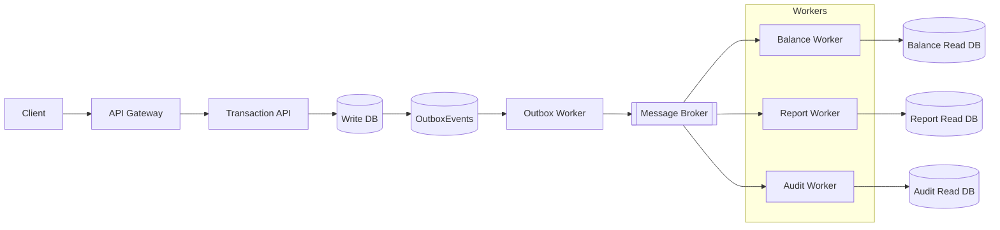
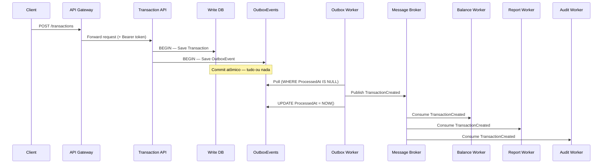

# Cashflow — Sistema de Transações Event-Driven

**Autor:** Antonio Leonardo  
**Plataforma:** .NET 10  
**Estilo arquitetural:** Microsserviços orientados a eventos  
**Estratégia:** Multicloud portável (AWS · Azure · GCP)

---

## Índice

1. [Visão geral](#1-visão-geral)
2. [Stack tecnológica](#2-stack-tecnológica)
3. [Fluxo principal](#3-fluxo-principal)
4. [Estratégia multicloud](#4-estratégia-multicloud)
5. [Abstração de mensageria](#5-abstração-de-mensageria)
6. [Abstração de banco de dados](#6-abstração-de-banco-de-dados)
7. [CQRS — Read e Write Models](#7-cqrs--read-e-write-models)
8. [Outbox Pattern](#8-outbox-pattern)
9. [Saga Pattern](#9-saga-pattern)
10. [Idempotência](#10-idempotência)
11. [Balance Worker — fluxo detalhado](#11-balance-worker--fluxo-detalhado)
12. [Logging multicloud](#12-logging-multicloud)
13. [Observabilidade](#13-observabilidade)
14. [Estrutura da solution](#14-estrutura-da-solution)
15. [Estrutura de namespaces](#15-estrutura-de-namespaces)
16. [Versionamento de eventos](#16-versionamento-de-eventos)
17. [Testes](#17-testes)
18. [CI/CD Pipeline](#18-cicd-pipeline)
19. [Infraestrutura Docker local](#19-infraestrutura-docker-local)
20. [Roteiro de implementação](#20-roteiro-de-implementação)
21. [Benefícios e portabilidade](#21-benefícios-e-portabilidade)

---

## 1. Visão geral

O **Cashflow** é um sistema de transações financeiras construído sobre os princípios de **Event-Driven Architecture**, **CQRS** e **Clean Architecture**. O objetivo central é garantir resiliência, escalabilidade e portabilidade real entre clouds, sem lock-in tecnológico.

### Princípios fundamentais

| Princípio | Implementação |
|---|---|
| Event-Driven | Eventos imutáveis como contratos entre serviços |
| CQRS | Write Model isolado dos Read Models por serviço |
| Clean Architecture | Domínio independente de infraestrutura |
| Saga Pattern | Coordenação distribuída com compensação |
| Outbox Pattern | Consistência atômica entre banco e mensageria |
| Idempotência | Consumidores seguros a reentregas |
| Multicloud | Abstrações trocáveis via configuração |

---

## 2. Stack tecnológica

```
Backend        .NET 10 · ASP.NET Core Web API · C#
Segurança      Keycloak (OIDC / OAuth2)
Containers     Docker · Docker Compose
Testes         xUnit · Testcontainers · k6
CI/CD          GitHub Actions
```

---

## 3. Fluxo principal

O fluxo completo parte do cliente até os workers consumidores, passando pelo Outbox Pattern que garante entrega confiável ao broker.



> Cada worker possui seu próprio banco, completamente isolado do Write Model (CQRS).

---

## 4. Estratégia multicloud

A arquitetura foi projetada para permitir troca de providers de infraestrutura sem alterar nenhuma regra de negócio. O domínio nunca conhece implementações concretas.

```
Application Layer
       │
       ▼
   Interfaces
  ┌────────────────────────────────┐
  │  IMessageBus                   │
  │  ITransactionRepository        │
  │  ILogService                   │
  └────────────────────────────────┘
       │
       ▼
  Providers (selecionados via appsettings.json)
  ┌──────────────┬──────────────┬──────────────┐
  │     AWS      │    Azure     │     GCP      │
  └──────────────┴──────────────┴──────────────┘
```

A seleção do provider é feita por configuração:

```json
{
  "Infrastructure": {
    "MessageBroker": "RabbitMQ",
    "Database": "PostgreSQL",
    "Logging": "CloudWatch"
  }
}
```

---

## 5. Abstração de mensageria

A interface `IMessageBus` define o contrato para publicação e consumo de eventos, independente do broker subjacente.

```csharp
// Cashflow.Shared.Messaging
public interface IMessageBus
{
    Task PublishAsync<T>(T message, CancellationToken ct = default) where T : class;
    Task SubscribeAsync<T>(Func<T, Task> handler, CancellationToken ct = default) where T : class;
}
```

### Implementações disponíveis

| Classe | Provider |
|---|---|
| `RabbitMqBus` | RabbitMQ (local / CloudAMQP) |
| `GooglePubSubBus` | Google Cloud Pub/Sub |
| `AwsMessagingBus` | AWS SNS + SQS |
| `AzureServiceBusBus` | Azure Service Bus |

```
Application
    │
    ▼
IMessageBus  ◄── injetado via DI
    │
    ├── RabbitMqBus
    ├── GooglePubSubBus
    ├── AwsMessagingBus
    └── AzureServiceBusBus
```

---

## 6. Abstração de banco de dados

O repositório de domínio é definido como interface, permitindo trocar o SGBD sem tocar no domínio ou na camada de aplicação.

```csharp
// Cashflow.Transaction.Domain
public interface ITransactionRepository
{
    Task<Transaction> GetByIdAsync(Guid id, CancellationToken ct = default);
    Task AddAsync(Transaction transaction, CancellationToken ct = default);
    Task<IEnumerable<Transaction>> GetByAccountIdAsync(Guid accountId, CancellationToken ct = default);
}
```

### Implementações

| Implementação | Provider |
|---|---|
| `PostgreSqlTransactionRepository` | PostgreSQL |
| `MySqlTransactionRepository` | MySQL |
| `SqlServerTransactionRepository` | SQL Server |
| Cloud-native | Cloud SQL · Amazon RDS · Azure Database |

---

## 7. CQRS — Read e Write Models

### Write Model

Responsável por gravar transações com consistência forte.

```
Banco recomendado:  PostgreSQL
Alternativas cloud: Cloud SQL · Amazon RDS · Azure Database for PostgreSQL
```

### Read Models

Cada worker mantém seu próprio modelo de leitura otimizado para seu caso de uso:

| Worker | Finalidade | Bancos suportados |
|---|---|---|
| Balance Worker | Saldo em tempo real | MongoDB · Redis · DynamoDB |
| Report Worker | Relatórios analíticos | BigQuery · Redshift · Snowflake · MongoDB |
| Audit Worker | Rastreabilidade e auditoria | MongoDB · Data Lake · BigQuery |

```
Write Side                          Read Side
──────────────────────────────────────────────────────
Transaction Service                 Balance Worker
  │                                   └── Balance DB (Redis/Mongo)
  │  (evento via broker)
  │                                 Report Worker
  └──────────────────────────────►    └── Report DB (BigQuery/Redshift)

                                    Audit Worker
                                      └── Audit DB (MongoDB/Data Lake)
```

---

## 8. Outbox Pattern

Garante consistência atômica entre a gravação no banco de dados e a publicação no broker de mensagens, eliminando o problema de falha parcial entre as duas operações.

### Tabela OutboxEvents

```sql
CREATE TABLE OutboxEvents (
    EventId      UUID        PRIMARY KEY,
    EventType    VARCHAR     NOT NULL,
    Payload      JSONB       NOT NULL,
    CreatedAt    TIMESTAMP   NOT NULL DEFAULT NOW(),
    ProcessedAt  TIMESTAMP   NULL
);
```

### Fluxo atômico

```
1. BEGIN TRANSACTION
   ├── INSERT INTO Transactions (...)
   └── INSERT INTO OutboxEvents (EventType, Payload, CreatedAt)
2. COMMIT  ◄── ambas as operações ou nenhuma

3. Outbox Worker (background service)
   ├── SELECT * FROM OutboxEvents WHERE ProcessedAt IS NULL
   ├── IMessageBus.PublishAsync(event)
   └── UPDATE OutboxEvents SET ProcessedAt = NOW()
```

> Sem o Outbox Pattern, uma falha entre `SaveChanges()` e `PublishAsync()` causaria perda silenciosa de eventos.

### Sequência completa — da requisição ao consumo

O diagrama abaixo evidencia dois detalhes importantes: o `Save OutboxEvent` acontece **dentro da mesma transação** que o `Save Transaction`, e o Outbox Worker faz **polling ativo** — não recebe push do banco.



---

## 9. Saga Pattern

Coordena a sequência de operações distribuídas entre workers, com suporte a eventos de compensação em caso de falha.

### Fluxo feliz

```
TransactionCreated
        │
        ▼
  Balance Worker ──► BalanceUpdated
                            │
                            ▼
                      Report Worker ──► ReportUpdated
                                              │
                                              ▼
                                        Audit Worker ──► AuditLogged
```

### Compensação em caso de falha

```
TransactionCreated
        │
        ▼
  Balance Worker  ──FALHA──►  BalanceRollback
                                    │
                                    ▼
                             TransactionCancelled
```

Cada evento de compensação desfaz a operação realizada pela etapa anterior, garantindo consistência eventual mesmo diante de falhas parciais.

---

## 10. Idempotência

Protege os consumidores contra o reprocessamento de eventos duplicados, situação comum em brokers com semântica de entrega *at-least-once*.

### Tabela ProcessedEvents

```sql
CREATE TABLE ProcessedEvents (
    EventId       UUID        NOT NULL,
    ConsumerName  VARCHAR     NOT NULL,
    ProcessedAt   TIMESTAMP   NOT NULL DEFAULT NOW(),
    PRIMARY KEY (EventId, ConsumerName)
);
```

### Fluxo do consumidor

```
Evento recebido
        │
        ▼
SELECT FROM ProcessedEvents
WHERE EventId = @eventId AND ConsumerName = @consumerName
        │
  ┌─────┴─────┐
  │ Encontrou │  ──► ACK · ignorar (já processado)
  └─────┬─────┘
        │ Não encontrou
        ▼
  Processar evento
        │
        ▼
INSERT INTO ProcessedEvents (EventId, ConsumerName, ProcessedAt)
        │
        ▼
      ACK
```

---

## 11. Balance Worker — fluxo detalhado

Ao receber um `TransactionCreatedEvent`, o Balance Worker executa cinco etapas em sequência:

```
TransactionCreatedEvent
{ transactionId, accountId, amount }
        │
        ▼
[1] Verificar idempotência
    ProcessedEvents WHERE EventId + ConsumerName = "Balance.Worker"
        │
   ┌────┴────┐
   │ já proc.│ ──► ACK · ignorar
   └────┬────┘
        │ novo
        ▼
[2] Calcular novo saldo
    currentBalance ± amount
        │
        ▼
[3] Persistir no Read Model
    MongoDB / Redis / DynamoDB
        │
        ▼
[4] Registrar em ProcessedEvents
    EventId · ConsumerName · ProcessedAt
        │
        ▼
[5] Publicar BalanceUpdated  ──► (continua a Saga → Report Worker)
```

O `CorrelationId` original é propagado no header de cada mensagem publicada.

---

## 12. Logging multicloud

Logs estruturados com campos padronizados em todos os serviços:

```json
{
  "timestamp":     "2025-01-15T10:30:00Z",
  "serviceName":   "Transaction.API",
  "correlationId": "550e8400-e29b-41d4-a716-446655440000",
  "transactionId": "7f3a1b2c-...",
  "userId":        "usr_abc123",
  "level":         "INFO",
  "message":       "Transaction created successfully"
}
```

### Interface e providers

```csharp
public interface ILogService
{
    void LogInformation(string message, object? context = null);
    void LogWarning(string message, object? context = null);
    void LogError(Exception ex, string message, object? context = null);
}
```

| Implementação | Provider |
|---|---|
| `CloudWatchLogService` | AWS CloudWatch |
| `AzureMonitorLogService` | Azure Monitor |
| `GoogleCloudLogService` | Google Cloud Logging |
| `ConsoleLogService` | Local / desenvolvimento |

---

## 13. Observabilidade

O sistema implementa rastreamento distribuído via **OpenTelemetry**. O `CorrelationId` é gerado na entrada da API e propagado por toda a cadeia.

```
Request ──► API Gateway
              │  X-Correlation-Id: abc-123
              ▼
         Transaction Service
              │  propagado no header da mensagem
              ▼
         Message Broker
              │  propagado no contexto do consumer
              ▼
         Balance Worker / Report Worker / Audit Worker
              │  incluído em todos os logs
              ▼
         Logging Provider (CloudWatch / Azure Monitor / GCP Logging)
```

Com o `CorrelationId` é possível reconstruir toda a jornada de uma transação através de qualquer ferramenta de log — de qualquer cloud.

---

## 14. Estrutura da solution

```
Cashflow.sln
│
├── src/
│   ├── Gateway/
│   │   └── Cashflow.Gateway
│   │
│   ├── Shared/
│   │   ├── Cashflow.Shared.Events
│   │   ├── Cashflow.Shared.Messaging
│   │   ├── Cashflow.Shared.Logging
│   │   └── Cashflow.Shared.Contracts
│   │
│   ├── Services/
│   │   └── TransactionService/
│   │       ├── Transaction.API
│   │       ├── Transaction.Application
│   │       ├── Transaction.Domain
│   │       └── Transaction.Infrastructure
│   │
│   ├── Workers/
│   │   ├── Balance.Worker
│   │   ├── Report.Worker
│   │   └── Audit.Worker
│   │
│   └── Outbox/
│       └── Outbox.Worker
│
└── tests/
    ├── UnitTests/
    │   ├── Transaction.Domain.Tests
    │   └── Balance.Domain.Tests
    ├── IntegrationTests/
    │   ├── Transaction.Integration.Tests
    │   └── Messaging.Integration.Tests
    ├── ConcurrencyTests/
    │   └── Transaction.Concurrency.Tests
    └── LoadTests/
        └── k6/
```

---

## 15. Estrutura de namespaces

### Domain

```
Cashflow.Transaction.Domain.Entities
Cashflow.Transaction.Domain.ValueObjects
Cashflow.Transaction.Domain.Events
```

### Application

```
Cashflow.Transaction.Application.Commands
Cashflow.Transaction.Application.Queries
Cashflow.Transaction.Application.Services
```

### Infrastructure

```
Cashflow.Transaction.Infrastructure.Persistence
Cashflow.Transaction.Infrastructure.Messaging
Cashflow.Transaction.Infrastructure.Logging
```

### Shared

```
Cashflow.Shared.Events
Cashflow.Shared.Messaging
Cashflow.Shared.Logging
```

### Workers

```
Cashflow.Balance.Worker
Cashflow.Report.Worker
Cashflow.Audit.Worker
```

---

## 16. Versionamento de eventos

Eventos são **contratos imutáveis**. Novas versões são adicionadas em paralelo sem quebrar consumidores existentes.

```
Cashflow.Shared.Events/
└── Transactions/
    ├── v1/
    │   └── TransactionCreatedEvent.cs
    │       { transactionId, accountId, amount }
    └── v2/
        └── TransactionCreatedEvent.cs
            { transactionId, accountId, amount, currency }
```

**Regras de evolução:**

- Nunca remover campos em versões existentes
- Novos campos obrigatórios → nova versão
- Consumidores podem optar por escutar `v1`, `v2` ou ambas
- O `EventType` publicado inclui a versão: `transaction.created.v1`

---

## 17. Testes

### Tipos e ferramentas

| Tipo | Projeto | Ferramenta |
|---|---|---|
| Unitário | `Transaction.Domain.Tests` | xUnit |
| Unitário | `Balance.Domain.Tests` | xUnit |
| Integração | `Transaction.Integration.Tests` | xUnit + Testcontainers |
| Integração | `Messaging.Integration.Tests` | xUnit + Testcontainers |
| Concorrência | `Transaction.Concurrency.Tests` | xUnit |
| Carga | `k6/` | k6 — 50 req/s |

### Testcontainers — exemplo de setup

```csharp
public class TransactionIntegrationTests : IAsyncLifetime
{
    private readonly PostgreSqlContainer _postgres = new PostgreSqlBuilder()
        .WithImage("postgres:16-alpine")
        .Build();

    private readonly RabbitMqContainer _rabbit = new RabbitMqBuilder()
        .WithImage("rabbitmq:3-management-alpine")
        .Build();

    public async Task InitializeAsync()
    {
        await _postgres.StartAsync();
        await _rabbit.StartAsync();
    }

    public async Task DisposeAsync()
    {
        await _postgres.DisposeAsync();
        await _rabbit.DisposeAsync();
    }
}
```

### k6 — script de carga

```javascript
// tests/LoadTests/k6/transaction-load.js
import http from 'k6/http';
import { check } from 'k6';

export const options = {
  vus: 50,
  duration: '60s',
  thresholds: {
    http_req_duration: ['p(95)<500'],
    http_req_failed: ['rate<0.01'],
  },
};

export default function () {
  const res = http.post('http://localhost:5000/api/transactions', JSON.stringify({
    accountId: '550e8400-e29b-41d4-a716-446655440000',
    amount: 100.00,
    type: 'credit',
  }), { headers: { 'Content-Type': 'application/json' } });

  check(res, { 'status 202': (r) => r.status === 202 });
}
```

---

## 18. CI/CD Pipeline

```yaml
# .github/workflows/ci.yml
name: CI

on:
  push:
    branches: [main, develop]
  pull_request:
    branches: [main]

jobs:
  build-and-test:
    runs-on: ubuntu-latest
    steps:
      - uses: actions/checkout@v4

      - name: Setup .NET 10
        uses: actions/setup-dotnet@v4
        with:
          dotnet-version: '10.0.x'

      - name: Restore
        run: dotnet restore

      - name: Build
        run: dotnet build --no-restore --configuration Release

      - name: Unit Tests
        run: dotnet test tests/UnitTests --no-build --configuration Release

      - name: Integration Tests
        run: dotnet test tests/IntegrationTests --no-build --configuration Release

      - name: Contract Tests
        run: dotnet test tests/ContractTests --no-build --configuration Release

      - name: Build Docker Images
        run: docker compose build
```

### Fluxo do pipeline

```
Commit / PR
     │
     ▼
GitHub Actions triggered
     │
     ├── dotnet restore
     ├── dotnet build
     ├── Unit Tests        (xUnit · rápido · sem I/O externo)
     ├── Integration Tests (xUnit · Testcontainers · Docker)
     ├── Contract Tests    (eventos · schemas · compatibilidade)
     └── docker compose build
               │
               ▼
          Artifact (imagens prontas para deploy)
```

---

## 19. Infraestrutura Docker local

O `docker-compose.yml` sobe toda a infraestrutura necessária para desenvolvimento e testes de integração locais.

```yaml
# docker-compose.yml
services:
  postgres:
    image: postgres:16-alpine
    environment:
      POSTGRES_DB: cashflow_write
      POSTGRES_USER: cashflow
      POSTGRES_PASSWORD: cashflow_dev
    ports: ["5432:5432"]

  mongodb:
    image: mongo:7
    ports: ["27017:27017"]

  redis:
    image: redis:7-alpine
    ports: ["6379:6379"]

  rabbitmq:
    image: rabbitmq:3-management-alpine
    ports:
      - "5672:5672"
      - "15672:15672"   # management UI

  keycloak:
    image: quay.io/keycloak/keycloak:23
    command: start-dev
    environment:
      KEYCLOAK_ADMIN: admin
      KEYCLOAK_ADMIN_PASSWORD: admin
    ports: ["8080:8080"]
```

```bash
# Subir a infraestrutura
docker compose up -d

# Verificar status
docker compose ps

# Derrubar
docker compose down -v
```

---

## 20. Roteiro de implementação

| Passo | Descrição |
|---|---|
| 1 | Criar a solution `.NET 10` com a estrutura de projetos |
| 2 | Criar `Transaction.API`, `Balance.Worker`, `Report.Worker`, `Audit.Worker`, `Outbox.Worker` |
| 3 | Subir infraestrutura local com `docker compose up -d` |
| 4 | Implementar o domínio de transação (`Entities`, `ValueObjects`, `Domain Events`) |
| 5 | Implementar persistência do Write Model (`ITransactionRepository` + PostgreSQL) |
| 6 | Criar e popular a tabela `OutboxEvents` |
| 7 | Implementar o `Outbox.Worker` (background service) |
| 8 | Conectar `Outbox.Worker` ao broker via `IMessageBus` |
| 9 | Implementar `Balance.Worker` com idempotência e Read Model |
| 10 | Implementar `Report.Worker` com Read Model analítico |
| 11 | Implementar `Audit.Worker` com persistência de auditoria |
| 12 | Adicionar `ILogService` com implementação para o provider escolhido |
| 13 | Adicionar `IMessageBus` com implementação multicloud |
| 14 | Tornar o repositório portável via interface |
| 15 | Criar testes unitários, de integração e de carga |

---

## 21. Benefícios e portabilidade

### Benefícios da arquitetura

| Característica | Como é garantida |
|---|---|
| Alta escalabilidade | Workers independentes, escalados horizontalmente |
| Desacoplamento | Comunicação exclusivamente via eventos |
| Observabilidade | CorrelationId + OpenTelemetry + logs estruturados |
| Resiliência | Outbox Pattern + Idempotência + Saga com compensação |
| Portabilidade | Abstrações trocáveis via configuração |
| Evolução segura | Versionamento de eventos sem breaking changes |

### Trocas possíveis sem alterar o domínio

```
Mensageria   RabbitMQ ←→ Google Pub/Sub ←→ AWS SNS/SQS ←→ Azure Service Bus
Banco Write  PostgreSQL ←→ Cloud SQL ←→ Amazon RDS ←→ Azure Database
Banco Read   MongoDB ←→ Redis ←→ DynamoDB ←→ DocumentDB
Relatórios   MongoDB ←→ BigQuery ←→ Redshift ←→ Snowflake
Logging      Console ←→ CloudWatch ←→ Azure Monitor ←→ Google Cloud Logging
```

### Deploy multicloud

A mesma codebase pode ser deployada em qualquer das três grandes clouds sem modificação:

```
Cashflow
  ├── AWS    ──── ECS · RDS · SNS/SQS · CloudWatch · DynamoDB
  ├── Azure  ──── AKS · Azure DB · Service Bus · Monitor · CosmosDB
  └── GCP    ──── GKE · Cloud SQL · Pub/Sub · Cloud Logging · Firestore
```

---

## Licença

Este projeto é de autoria de **Antonio Leonardo** e está sujeito aos termos de licença definidos pelo autor.

---

*Documentação gerada com base na arquitetura completa do sistema Cashflow — versão multicloud.*
