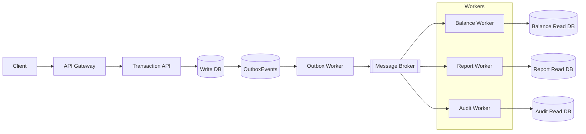
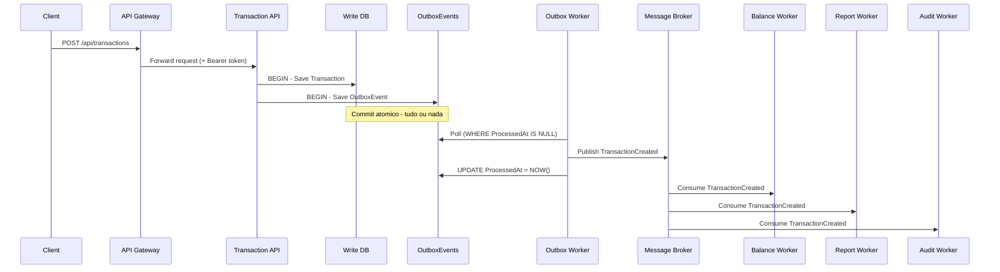

# Cashflow - Sistema de Transacoes Event-Driven

**Autor:** Antonio Leonardo  
**Plataforma:** .NET 10  
**Estilo arquitetural:** Microsservicos orientados a eventos  
**Estrategia:** Multicloud portavel (AWS, Azure, GCP)  
**Execucao local (TDD):** Visual Studio 2026 Community + Docker

---

## Indice

1. [Visao geral](#1-visao-geral)
2. [Decisoes arquiteturais e trade-offs](#2-decisoes-arquiteturais-e-trade-offs)
3. [Requisitos nao funcionais](#3-requisitos-nao-funcionais)
4. [Integracao entre componentes](#4-integracao-entre-componentes)
5. [Stack tecnologica](#5-stack-tecnologica)
6. [Arquitetura e diagramas](#6-arquitetura-e-diagramas)
7. [Fluxo principal](#7-fluxo-principal)
8. [Versionamento de eventos](#8-versionamento-de-eventos)
9. [Testes e qualidade](#9-testes-e-qualidade)
10. [Execucao local](#10-execucao-local)
11. [Estrutura da solution](#11-estrutura-da-solution)
12. [CI/CD](#12-cicd)
13. [Roadmap](#13-roadmap)

---

## 1. Visao geral

O **Cashflow** e um sistema de transacoes financeiras construido sobre **Event-Driven Architecture**, **CQRS** e **Clean Architecture**. O objetivo central e garantir resiliencia, escalabilidade e portabilidade real entre clouds, sem lock-in tecnologico.

Principios fundamentais:

- Event-Driven: eventos imutaveis como contratos entre servicos
- CQRS: Write Model isolado dos Read Models por servico
- Clean Architecture: dominio independente de infraestrutura
- Outbox Pattern: consistencia atomica entre banco e mensageria
- Idempotencia: consumidores seguros a reentregas
- Observabilidade: CorrelationId + logs estruturados



---

## 2. Decisoes arquiteturais e trade-offs

### Fontes oficiais de decisao

- `docs/decisions/adr-001-microservices-vs-monolith.md`
- `docs/decisions/adr-002-event-driven-vs-sync.md`
- `docs/decisions/adr-003-db-per-service-cqrs.md`
- `docs/decisions/adr-004-gateway-auth-keycloak.md`
- `docs/decisions/decision-matrix.md`

### Consolidado de trade-offs

- ADR-001: microsservicos para isolamento de falhas e escala por servico; trade-off operacional.
- ADR-002: eventos + outbox para desacoplamento e resiliencia; trade-off de consistencia eventual.
- ADR-003: CQRS + database-per-service para performance no read side; trade-off de materializacao cross-service.
- ADR-004: gateway + OIDC para politica de acesso unica; trade-off de dependencia adicional do IdP.

### Encadeamento das decisoes


---

## 3. Requisitos nao funcionais

Escalabilidade:

- Servicos stateless com escalonamento horizontal (API e workers).
- Filas por evento e processamento assincrono para backpressure.
- Read models otimizados (Redis, MongoDB, DynamoDB) para consultas rapidas.
- Politicas de resiliencia (retry, circuit breaker, bulkhead, timeout) via `Cashflow.Shared.Resilience`.
- Meta operacional validada por carga: `50 req/s` com ate `5%` de perda (`http_req_failed <= 0.05`) e latencia `p95 <= 1500 ms`.

Resiliencia:

- Outbox Pattern para evitar falha parcial entre banco e broker.
- Consumidores idempotentes e controle de reentrega.
- DLQ e retry com atraso configuravel por consumidor (RabbitMQ).
- Isolamento por servico e por fila para evitar falhas em cascata.

Disponibilidade:

- Independencia entre servicos: falha de um worker nao bloqueia os demais.
- Gateway e API podem evoluir sem downtime dos workers.
- Arquitetura preparada para multi-az e multi-cloud com configuracao externa.

Seguranca e observabilidade:

- Autenticacao centralizada via Keycloak (OIDC/OAuth2).
- CorrelationId propagado em toda a cadeia de eventos.
- Logs estruturados e rastreio distribuido com OpenTelemetry.

---

## 4. Integracao entre componentes

- Comunicacao assincrona via eventos (mensageria com envelopes e metadados).
- Outbox Worker publica eventos de dominio de forma confiavel.
- Saga Pattern coordena etapas com compensacoes em caso de falha.
- Versionamento de eventos protege contratos sem breaking changes.

A integracao real ocorre exclusivamente por mensageria. Chamadas sincronas ficam restritas ao Gateway -> Transaction API, preservando desacoplamento entre workers.

---

## 5. Stack tecnologica

```
Backend        .NET 10 | ASP.NET Core Web API | C#
Seguranca      Keycloak (OIDC / OAuth2)
Mensageria     RabbitMQ (local) + abstracoes multicloud
Containers     Docker | Docker Compose
Testes         xUnit | Testcontainers | Pact | k6
CI/CD          GitHub Actions
```

---

## 6. Arquitetura e diagramas

A documentacao completa de arquitetura, fluxos de dados e diagramas esta em `docs/architecture.md`.
O runbook de carga do Passo 3 esta em `Back.End/Tests/Performance/README.md`.

---

## 7. Fluxo principal



---

## 8. Versionamento de eventos

Eventos sao **contratos imutaveis**. Novas versoes sao adicionadas em paralelo sem quebrar consumidores existentes.

```
Cashflow.Shared.Events/
  Transactions/
    v1/TransactionCreatedEvent.cs
    v2/TransactionCreatedEvent.cs
```

Regras de evolucao:

- Nunca remover campos em versoes existentes
- Novos campos obrigatorios exigem nova versao
- Consumidores podem optar por escutar v1, v2 ou ambas
- O `EventType` publicado inclui a versao

---

## 9. Testes e qualidade

Tipos e objetivos:

- Unitarios: regras de dominio e validacoes puras
- Integracao: bancos, mensageria e gateway de autenticacao
- E2E: pipeline completo de eventos e read models
- Contract: compatibilidade entre Gateway e Transaction API

Novidade: testes de integracao do Gateway com Keycloak garantem autenticacao real por OIDC.

Como rodar testes (exemplos):

```bash
# Gateway + Keycloak
 dotnet test Back.End/Tests/IntegrationTests/Gateway/Gateway.Integration.Tests.csproj

# E2E completo
 dotnet test Back.End/Tests/E2E
```

Teste de carga NFR (Passo 3):

```bash
# sobe stack principal
docker compose up -d

# executa perfil de carga (k6)
docker compose --profile perf run --rm k6
```

Evidencia gerada:

- `Back.End/Tests/Performance/results/transactions-throughput-summary.json`
- Wrapper para Test Explorer (Visual Studio): `Back.End/Tests/Performance/k6/K6.Performance.Tests.csproj`
- Cenario NFR aprofundado: indisponibilidade do `balance-worker` sob carga com disponibilidade do write path.

---

## 10. Execucao local

Subir infraestrutura:

```bash
docker compose up -d
```

Servicos principais:

- Gateway: `http://localhost:5000`
- Transaction API: `http://localhost:5001`
- Keycloak: `http://localhost:8081`

Execucao de carga com perfil dedicado:

- `docker compose --profile perf run --rm k6`

---

## 11. Estrutura da solution

```
Cashflow.slnx
  Back.End/
    Gateway -> Cashflow.Gateway
    Outbox/Worker -> Cashflow.Outbox.Worker
    Service/Transaction (API, Application, Domain, Infrastructure)
    Worker (Balance, Report, Audit)
    Shared (Events, Messaging, Logging, Resilience, Contracts)
    Tests
      ContractTests/Gateway
      IntegrationTests/Gateway
      IntegrationTests/Messaging
      IntegrationTests/Transaction
      IntegrationTests/Worker
      DomainTests
      ConcurrencyTests
      E2E
      Shared
```

---

## 12. CI/CD

Pipeline atual:

- Restore e build
- Testes unitarios, integracao e contract
- Build de imagens Docker

---

## 13. Roadmap

- Exposicao de dados via API (queries otimizadas)
- Front-end minimo para exibicao
- Migracao do `docker compose` para Kubernetes

---

Licenca: Projeto de autoria de Antonio Leonardo.
