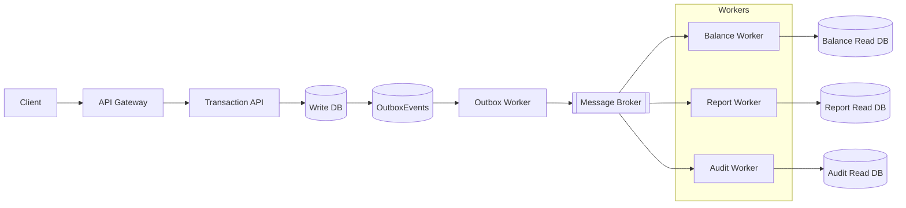
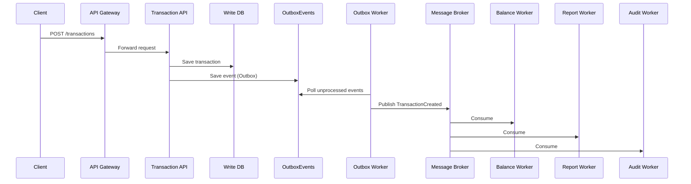

# Arquitetura - Sistema de Transacoes Event-Driven

```mermaid
flowchart LR
  client[Client]
  gw[API Gateway]
  txapi[Transaction API]
  writedb[(Write DB)]
  outbox[(OutboxEvents)]
  outboxw[Outbox Worker]
  broker[[Message Broker]]

  client --> gw --> txapi --> writedb --> outbox --> outboxw --> broker

  subgraph Workers
    bal[Balance Worker]
    rep[Report Worker]
    aud[Audit Worker]
  end

  broker --> bal
  broker --> rep
  broker --> aud

  bal --> baldb[(Balance Read DB)]
  rep --> repdb[(Report Read DB)]
  aud --> auddb[(Audit Read DB)]
```

```mermaid
sequenceDiagram
  participant C as Client
  participant G as API Gateway
  participant T as Transaction API
  participant W as Write DB
  participant O as OutboxEvents
  participant OW as Outbox Worker
  participant MB as Message Broker
  participant BW as Balance Worker
  participant RW as Report Worker
  participant AW as Audit Worker

  C->>G: POST /transactions
  G->>T: Forward request
  T->>W: Save transaction
  T->>O: Save event (Outbox)
  OW->>O: Poll unprocessed events
  OW->>MB: Publish TransactionCreated
  MB->>BW: Consume
  MB->>RW: Consume
  MB->>AW: Consume
```
