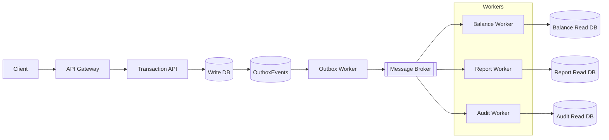
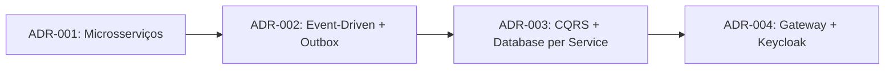

# Cashflow - Sistema de Transações Event-Driven

**Autor:** Antonio Leonardo
**Plataforma:** .NET 10
**Estilo arquitetural:** Microsserviços orientados a eventos
**Estratégia:** Multicloud portável (AWS, Azure, GCP)
**Execução local (TDD):** Visual Studio 2026 Community + Docker

---

## Índice

1. [Visão geral](#1-Visão-geral)
2. [Decisões arquiteturais e trade-offs](#2-Decisões-arquiteturais-e-trade-offs)
3. [Requisitos não funcionais](#3-requisitos-não-funcionais)
4. [Integração entre componentes](#4-Integração-entre-componentes)
5. [Stack tecnológica](#5-stack-tecnológica)
6. [Arquitetura e diagramas](#6-arquitetura-e-diagramas)
7. [Fluxo principal](#7-fluxo-principal)
8. [Versionamento de eventos](#8-versionamento-de-eventos)
9. [Testes e qualidade](#9-testes-e-qualidade)
10. [Execução local](#10-Execução-local)
11. [Estrutura da solution](#11-estrutura-da-solution)
12. [CI/CD](#12-cicd)
13. [Roadmap](#13-roadmap)

---

## 1. Visão geral

O **Cashflow** é um sistema de transações financeiras construído sobre **Event-Driven Architecture**, **CQRS** e **Clean Architecture**. O objetivo central é garantir resiliência, escalabilidade e portabilidade real entre clouds, sem lock-in tecnológico.

Princípios fundamentais:

- Event-Driven: eventos imutáveis como contratos entre serviços
- CQRS: Write Model isolado dos Read Models por serviço
- Clean Architecture: domínio independente de infraestrutura
- Outbox Pattern: consistência atômica entre banco e mensageria
- Idempotência: consumidores seguros a reentregas
- Observabilidade: CorrelationId + logs estruturados



---

## 2. Decisões arquiteturais e trade-offs

### Fontes oficiais de decisão

- `docs/decisions/adr-001-microservices-vs-monolith.md`
- `docs/decisions/adr-002-event-driven-vs-sync.md`
- `docs/decisions/adr-003-db-per-service-cqrs.md`
- `docs/decisions/adr-004-gateway-auth-keycloak.md`
- `docs/decisions/decision-matrix.md`

### Consolidado de trade-offs

- ADR-001: Microsserviços para isolamento de falhas e escala por serviço; trade-off operacional.
- ADR-002: eventos + outbox para desacoplamento e resiliência; trade-off de consistência eventual.
- ADR-003: CQRS + database-per-service para performance no read side; trade-off de materialização cross-service.
- ADR-004: gateway + OIDC para política de acesso única; trade-off de dependência adicional do IdP.

### Encadeamento das Decisões



---

## 3. Requisitos não funcionais

Escalabilidade:

- Serviços stateless com escalonamento horizontal (API e workers).
- Filas por evento e processamento assíncrono para backpressure.
- Read models otimizados (Redis, MongoDB, DynamoDB) para consultas rápidas.
- Políticas de resiliência (retry, circuit breaker, bulkhead, timeout) via `Cashflow.Shared.Resilience`.
- Meta operacional validada por carga: `50 req/s` com até `5%` de perda (`http_req_failed <= 0.05`) e latência `p95 <= 1500 ms`.

Resiliência:

- Outbox Pattern para evitar falha parcial entre banco e broker.
- Consumidores idempotentes e controle de reentrega.
- DLQ e retry com atraso configurável por consumidor (RabbitMQ).
- Recuperação automática de conexão no cliente RabbitMQ (`AutomaticRecoveryEnabled` + `TopologyRecoveryEnabled`).
- Isolamento por serviço e por fila para evitar falhas em cascata.

Disponibilidade:

- Independência entre serviços: falha de um worker não bloqueia os demais.
- Gateway e API podem evoluir sem downtime dos workers.
- Endpoints de saúde (`/health/live` e `/health/ready`) no Gateway e na Transaction API.
- Arquitetura preparada para multi-az e multi-cloud com configuração externa.

Segurança e observabilidade:

- Autenticação centralizada via Keycloak (OIDC/OAuth2).
- Autorização por política de escopo/role no write path (`transactions.write` / `transactions.writer`).
- Rate limiting no Gateway e na Transaction API para proteção de borda.
- CorrelationId propagado em toda a cadeia de eventos.
- Logs estruturados e rastreio distribuído com OpenTelemetry.

Métricas operacionais (SLI/SLO) e evidências: `docs/sli-slo.md`.

---

## 4. Integração entre componentes

- Comunicação assíncrona via eventos (mensageria com envelopes e metadados).
- Outbox Worker publica eventos de domínio de forma confiável.
- Saga Pattern coordena etapas com compensações em caso de falha.
- Versionamento de eventos protege contratos sem breaking changes.
- Validação de integração robusta por teste: fan-out entre consumidores independentes e envio para DLQ após retries.

A integração real ocorre exclusivamente por mensageria. Chamadas síncronas ficam restritas ao Gateway -> Transaction API, preservando desacoplamento entre workers.

---

## 5. Stack tecnológica

```
Backend        .NET 10 | ASP.NET Core Web API | C#
Segurança      Keycloak (OIDC / OAuth2)
Mensageria     RabbitMQ (local) + abstrações multicloud
Containers     Docker | Docker Compose
Testes         xUnit | Testcontainers | Pact | k6
CI/CD          GitHub Actions
```

---

## 6. Arquitetura e diagramas

A documentação completa de arquitetura, fluxos de dados e diagramas está em `docs/architecture.md`.
O runbook de carga do Passo 3 está em `Back.End/Tests/Performance/README.md`.

---

## 7. Fluxo principal


---

## 8. Versionamento de eventos

Eventos são **contratos imutáveis**. Novas versões são adicionadas em paralelo sem quebrar consumidores existentes.

```
Cashflow.Shared.Events/
  Transactions/
    v1/TransactionCreatedEvent.cs
    v2/TransactionCreatedEvent.cs
```

Regras de Evolução:

- Nunca remover campos em versões existentes
- Novos campos obrigatórios exigem nova versão
- Consumidores podem optar por escutar v1, v2 ou ambas
- O `EventType` publicado inclui a versão

---

## 9. Testes e qualidade

Tipos e objetivos:

- Unitários: regras de domínio e validações puras
- Integração: bancos, mensageria e gateway de autenticação
- E2E: pipeline completo de eventos e read models
- Contract: compatibilidade entre Gateway e Transaction API

Novidade: testes de integração do Gateway com Keycloak garantem Autenticação real por OIDC.

Como rodar testes (exemplos):

```bash
# Gateway + Keycloak
 dotnet test Back.End/Tests/IntegrationTests/Gateway/Gateway.Integration.Tests.csproj

# E2E completo
 dotnet test Back.End/Tests/E2E
```

Teste de carga NFR (Passo 3):

```bash
# sobe stack principal
docker compose up -d

# executa perfil de carga (k6)
docker compose --profile perf run --rm k6
```

Evidência gerada:

- `Back.End/Tests/Performance/results/transactions-throughput-summary.json`
- Wrapper para Test Explorer (Visual Studio): `Back.End/Tests/Performance/k6/K6.Performance.Tests.csproj`
- cenário NFR aprofundado: indisponibilidade do `balance-worker` sob carga com disponibilidade do write path.
- Integração de mensageria aprofundada: `Back.End/Tests/IntegrationTests/Messaging/RabbitMqDecouplingIntegrationTests.cs`
- Segurança de borda validada em Integração (401/403/201): `Back.End/Tests/IntegrationTests/Holistic/HolisticIntegrationTests.cs`
- Recuperação de pipeline após reinício do Outbox Worker: `Back.End/Tests/IntegrationTests/Holistic/HolisticIntegrationTests.cs`
- Health endpoints validados em Integração: `Back.End/Tests/IntegrationTests/Holistic/HolisticIntegrationTests.cs`
- Gates de qualidade (ação 7): `docs/tests-quality-gates.md`
- Matriz holística 1-8 (ação 8): `docs/holistic-execution-matrix.md`
- Runner único de validação holística: `Back.End/Tests/run-holistic-validation.ps1`

---

## 10. Execução local

Subir infraestrutura:

```bash
docker compose up -d
```

serviços principais:

- Gateway: `http://localhost:5000`
- Transaction API: `http://localhost:5001`
- Balance Query API: `http://localhost:5002`
- Keycloak: `http://localhost:8081`

Execução de carga com perfil dedicado:

- `docker compose --profile perf run --rm k6`

---

## 11. Estrutura da solution

```
Cashflow.slnx
  Back.End/
    Gateway -> Cashflow.Gateway
    Outbox/Worker -> Cashflow.Outbox.Worker
    Service/Balance/API -> Cashflow.Service.Balance.API
    Service/Transaction (API, Application, Domain, Infrastructure)
    Worker (Balance, Report, Audit)
    Shared (Events, Messaging, Logging, Resilience, Contracts)
    Tests
      ContractTests/Gateway
      IntegrationTests/Gateway
      IntegrationTests/Messaging
      IntegrationTests/Transaction
      IntegrationTests/Worker
      DomainTests
      ConcurrencyTests
      E2E
      Shared
```

---

## 12. CI/CD

Pipeline atual:

- Restore e build
- Testes unitários, Integração e contract
- Build de imagens Docker (incluindo `balance-query-api`)

---

## 13. Roadmap

- Expandir consultas otimizadas para read models de relatório e auditoria
- Front-end mínimo para exibição
- Migração do `docker compose` para Kubernetes

---

licença: Projeto de autoria de Antonio Leonardo.
